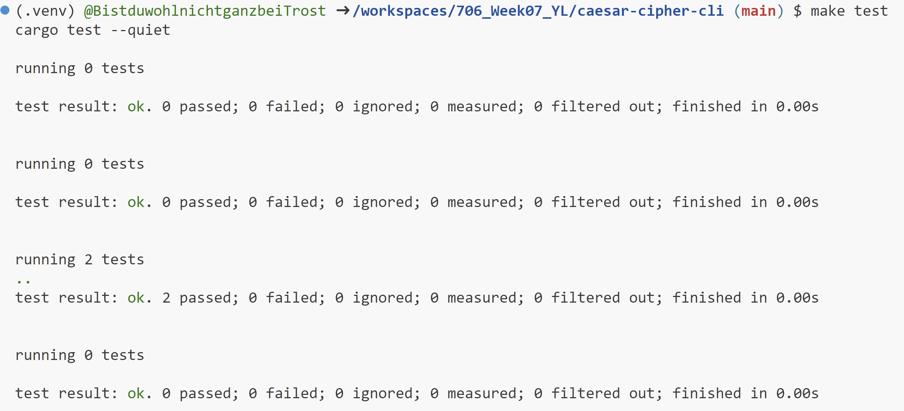

# 706_Week07_YL

This repository includes the main tasks for Week 7:

* `Makefile` is a configuration file used in Unix-based systems for automating tasks and building software. It contains instructions and dependencies for compiling code, running tests, and other development tasks.
* `.devcontainer` includes a Dockerfile and `devcontainer.json`. The `Dockerfile` within this folder specifies how the container should be built, and other settings in this directory may control development environment configurations.
* `Workflows` includes GitHub Actions, which contain configuration files for setting up automated build, test, and deployment pipelines for your project.
* `.gitignore` is used to specify which files or directories should be excluded from version control when using Git.
* `README.md` is the instruction file for the readers.
* `Cargo.toml`
* `lib.rs`
* `main.rs`
* `test.rs`

## Project description

* Package a Python script with setuptools. I focus on building a Rust command line tool.
* Include a user guide on usage and installation

## Project environment

* Use codespace for scripting
* Set up for Rust, install Rust and Cargo, and check the versions (Rust 1.73.0 and Cargo 1.73.0)
* Go into the directory `caesar-cipher-cli`, and Run `cargo build` to compile the changes and `cargo run` to test the modified tool.

## Project Guide

* Select the folder `caesar-cipher-cli` from the course repo.
* Create `main.rs` and `lib.rs` under the `src` file.
* Create a function `int_to_ascii` in `lib.rs` to encode a number to a corresponding character by ASCII rule.
* Add a command line to `int_to_ascii` to fit the new function.
* Create a function `read_input` to accept file format input with `.txt` file.
* Create `test.rs` to test the written functions.

Description:
* We can encrypt a string: `cargo run -- --message "string" --encrypt --shift "shift value"`.
* We can decrypt a string: `cargo run -- --message "string" --decrypt --shift "shift value"`.
* We can transfer an integer value to a corresponding character by ASCII rule: `cargo run -- --int-to-ascii --message int`.
* We can change the content after message to `.txt` file: `cargo run -- --encrypt --message test.txt --shift 3` and `cargo run -- --int-to-ascii --message test.txt`.

Examples:
* `cargo run -- --message "Hello World" --encrypt --shift 2`. The output is `Jgnnq Yqtnf`.
* `cargo run -- --int-to-ascii --message 65`. The output is `A`.

## Check format & errors

1. make format

2. make lint

3. make test

### References

https://nogibjj.github.io/candle-cookbook/

https://github.com/nogibjj/rust-data-engineering

